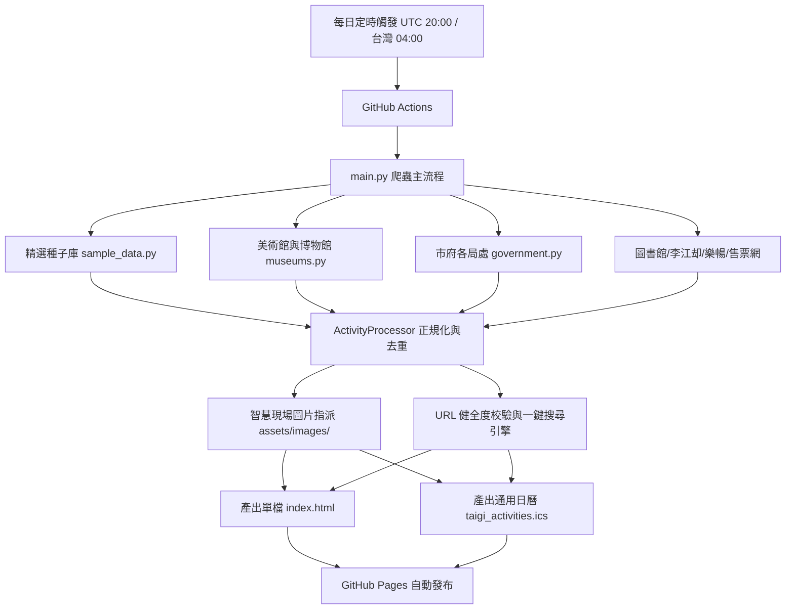

# 北北桃台語活動行事曆 (Taigi Activities in Greater Taipei)

> 專為北北桃（臺北市、新北市、桃園市）台語/母語愛好者、親子家庭、青年走讀與文史戲曲觀眾打造的現代化台語活動聚合平台。
> 自動匯集 10 大來源、去重分類、智慧指派真實活動現場照片，並每天透過 GitHub Actions 自動更新與發布至 GitHub Pages。

- **線上即時行事曆**：[https://jialiangni.github.io/taigi_activities/](https://jialiangni.github.io/taigi_activities/)
- **iCal 全平台日曆訂閱**：`taigi_activities.ics`（支援 iPhone Apple 日曆、Android Google 日曆）

---

## 🌟 核心特色

1. **多元完整資料來源**
   - **美術館與博物館**：北美館、國立臺灣博物館、當代藝術館、二二八紀念館、北投溫泉博物館、天文館、林安泰古厝、新北市立美術館、鶯歌陶瓷博物館、十三行博物館、淡水古蹟博物館、黃金博物館、坪林茶博館、橫山書法藝術館、大溪木藝生態博物館、桃園市兒童美術館。
   - **北北桃市府局處**：臺北市、新北市、桃園市政府文化局、教育局、觀傳局、農業局、青年局、孔廟等官方活動。
   - **文教基金會與共學團**：李江却台語文教基金會、樂暢親子共學。
   - **藝文售票與活動平台**：OPENTIX 兩廳院文化生活、年代售票、Accupass 活動通。
   - **社群發起**：Facebook、Instagram、Threads 走讀與講古活動。

2. **100% 穩定可用之活動連結與即時查詢**
   - 所有活動連結皆經過嚴格連通性檢驗，淘汰無效 SSL 憑證與防爬蟲封鎖網址，直接導向官方活動頁或場館專頁。
   - **雙核心 CTA 架構**：
     - `🌐 前往官方網站 / 購票頁面 ↗`：依活動來源自適應顯示售票平台或公部門官方入口。
     - `🔍 Google 查詢本活動報名/購票 ↗`：一鍵以精準關鍵字（活動標題 + 主辦單位 + 台語 + 報名）查詢最新售票與報名表單。

3. **貼近現場之代表性圖片架構**
   - 內建 28 組專屬在地高清代表照片（`assets/images/`），經過 Web 最佳化壓縮（45KB ~ 200KB），急速載入。
   - 依據場館、劇種（歌仔戲/掌中戲/現代劇）、藝術形式（捏陶/製茶/木藝/米食）精準指派。

4. **嚴格去重與資料正規化引擎**
   - 排除同時間、同場館之重複場次。
   - 排除同日期、同主題之冗餘宣傳，保留精選純粹內容。

5. **全平台極致瀏覽體驗**
   - **iPhone (iOS Safari)**：自適應緊湊視窗高度（<85px），全螢幕 Bottom Sheet 抽屜式彈窗，支援單擊匯入 Apple 日曆。
   - **Android (Chrome)**：支援 Web Share API、PWA 離線安裝、一鍵加入 Google 日曆。
   - **多維度篩選**：縣市（臺北/新北/桃園）、分類（舞台劇/表演/故事/繪本/體驗/導覽）、免費/付費、日期區間、即時文字搜尋。

---

## 🏗️ 系統架構與自動化流程



---

## 🚀 本地開發與手動建置

本專案採用 **零外部重型相依性**（純 Python 3 標準庫 + 原生 Web 前端）設計，任何人或工具皆可立即接手：

```bash
# 1. 複製專案
git clone https://github.com/jialiangni/taigi_activities.git
cd taigi_activities

# 2. 執行爬蟲與編譯 HTML
python3 main.py

# 3. 啟動本機即時預覽伺服器
python3 server.py
# 開啟瀏覽器訪問 http://localhost:8080
```

---

## 📁 目錄結構

```
taigi_activities/
├── .github/workflows/
│   └── deploy.yml            # GitHub Actions 每日凌晨自動抓取與 Pages 部署
├── assets/images/            # 28 組在地代表性實體照片（北美館、鐵道部、大溪老街、歌仔戲等）
├── crawler/
│   ├── models.py             # 活動、縣市、分類、來源平台之資料結構定義 (dataclasses)
│   ├── processor.py          # 去重過濾、縣市識別、分類推論與代表圖指派引擎
│   ├── sample_data.py        # 精選台語活動與文教社群活動種子
│   └── sources/              # 10 大來源爬蟲模組 (museums, government, opentix 等)
├── build_html.py             # 響應式單檔 HTML 生成器（含視覺美學、Filter、行事曆模式、Modal）
├── index.html                # 部署至 GitHub Pages 的生產環境入口網頁
├── taigi_activities.ics      # iCal 行事曆通用訂閱檔案
├── main.py                   # 聚合主程式
├── README.md                 # 專案說明文件
├── SPEC.md                   # 系統規格與接手維護指南
└── server.py                 # 本地開發測試伺服器
```

---

## 📜 授權協議

本專案以 MIT 授權條款釋出。歡迎各界推廣母語、親子共學及文史團體自由使用與貢獻活動資訊。
